# Statistical Arbitrage Market Making Engine

A production-grade C++20 statistical arbitrage market-making system that combines Avellaneda-Stoikov optimal quoting, cointegration-based pair selection, and order flow toxicity detection into a coherent strategy with real-time risk management, realistic execution simulation, and walk-forward backtesting.

---

## Strategy Overview

This engine unifies three quantitative pillars:

1. **Avellaneda-Stoikov (2008)** optimal market making provides the quoting framework -- the reservation price adjusts for inventory risk, and the optimal spread compensates for adverse selection via an order intensity model calibrated from fill data.

2. **Cointegration-based signals** (Engle-Granger + Johansen) identify mean-reverting pairs, with Kalman-filtered dynamic hedge ratios that track structural changes online. The z-score of the Kalman innovation drives entry/exit timing.

3. **Microstructure toxicity signals** (VPIN, Kyle's lambda, multi-level OFI with Lee-Ready classification) modulate the spread width in real time -- widening quotes when informed trading is detected, reducing adverse selection by an estimated 30%.

The risk management layer enforces position limits, drawdown circuit breakers, fat-finger protection, and rate limiting on every quote, with zero-allocation pre-trade checks completing in under 100ns.

---

## Performance

| Operation      | Throughput          | Latency (p50) |
| -------------- | ------------------- | ------------- |
| Add Order      | **16.41 M ops/sec** | 61 ns         |
| Cancel Order   | **11.08 M ops/sec** | 90 ns         |
| Match Order    | **4.38 M ops/sec**  | 228 ns        |
| Mixed Workload | **9.35 M ops/sec**  | 107 ns        |

**Hardware**: AMD Ryzen 7 2700x, single-threaded, no kernel bypass.

---

## Architecture

```mermaid
graph TB
    MD[Market Data<br/>LOBSTER L3] --> RE[ReplayEngine<br/>Deterministic replay]
    RE --> OB[OrderBook<br/>16M ops/sec, O&#40;1&#41;]
    RE --> SIG[Signal Layer]

    subgraph SIG[Signal Generation]
        SM[SpreadModel<br/>Kalman-filtered beta]
        OFI[Multi-Level OFI<br/>Lee-Ready classification]
        VP[VPIN<br/>Volume-sync toxicity]
        KL[Kyle Lambda<br/>Price impact]
    end

    SIG --> AS[StatArbMM<br/>A-S optimal quotes]
    AS --> RM[RiskManager<br/>Zero-alloc pre-trade]
    RM --> ES[ExecutionSimulator<br/>Latency + queue + AS]
    ES --> PNL[PnL Analytics<br/>Sharpe, Sortino, Calmar]
    PNL --> WF[Walk-Forward<br/>Overfit ratio]
```



---

## Key Components

### Avellaneda-Stoikov Market Making (`src/strategy/StatArbMM.hpp`)
- Full closed-form: `r = s - q*gamma*sigma^2*tau`, `delta = gamma*sigma^2*tau + (2/gamma)*ln(1+gamma/k)`
- Terminal time degradation (tau decays to 0 at session end)
- Order intensity calibration from fill rate data
- Signal modulation: spread widens with VPIN and Kyle's lambda

### Kalman Filter (`src/signals/KalmanFilter.hpp`)
- 2x2 state-space model for dynamic hedge ratio tracking
- Hand-rolled matrix ops (no Eigen on hot path)
- Z-score uses Kalman innovation variance (principled uncertainty)
- Delta parameter controls adaptation speed (Chan 2013)

### Cointegration Analysis (`src/analytics/CointegrationTests.hpp`)
- Engle-Granger with ADF lag selection via BIC (Schwert 1989)
- Johansen trace and max-eigenvalue tests (bivariate)
- OU parameter estimation via concentrated MLE (Brent's method)
- MacKinnon (1996) response surface p-values

### Risk Management (`src/risk/RiskManager.hpp`)
- `std::array` indexed by symbolId (no hash maps on hot path)
- Pre-trade checks: position limits, loss limits, drawdown, fat-finger, rate limiting
- Atomic kill switch with auto-activation on drawdown breach
- Typed `RiskCheckResult` enum for audit logging

### Microstructure Signals
- **VPIN** (`src/signals/VPIN.hpp`): Volume-synchronized toxicity detection
- **Kyle's Lambda** (`src/signals/KyleLambda.hpp`): Permanent price impact estimation
- **Multi-Level OFI** (`src/signals/OFI.hpp`): K-level order flow with Lee-Ready classification

### Backtesting (`src/backtest/`)
- Event-driven (not vectorized) to prevent lookahead bias
- Realistic fill model via `ExecutionSimulator` (latency, queue position, adverse selection)
- Almgren-Chriss transaction cost model (`src/execution/TransactionCosts.hpp`)
- Walk-forward optimization with overfit ratio reporting

---

## Design Decisions

| Decision | Why | Tradeoff |
|----------|-----|----------|
| PMR monotonic buffer | 5ns alloc vs 100-500ns malloc | Memory not freed until reset |
| CRTP matching dispatch | Eliminates vtable + enables inlining | Compile-time strategy binding |
| Hand-rolled 2x2 Kalman | No Eigen dependency on hot path | Manual matrix code |
| Fixed arrays in RiskManager | O(1) with no hash, no allocation | Max 64 symbols |
| OU MLE via Brent's method | Less biased than AR(1) OLS | More complex implementation |
| Event-driven backtesting | Prevents lookahead bias | Slower than vectorized |

See [docs/design_decisions.md](docs/design_decisions.md) for detailed rationale.

---

## Build

```bash
# Configure and build
cmake -B build -DCMAKE_BUILD_TYPE=Release
cmake --build build

# Run tests
./bin/orderbook_tests
./bin/strategy_tests
./bin/kalman_tests
./bin/cointegration_gtest
./bin/risk_tests
./bin/integration_tests

# Run benchmarks
./bin/orderbook_bench
./bin/strategy_benchmark

# Run demo
./bin/stat_arb_runner
```

### Dependencies (fetched automatically via CMake FetchContent)
- GoogleTest v1.14.0
- Google Benchmark v1.8.3
- Eigen 3.4.0 (analytics layer only)

---

## Project Structure

```
src/
├── core/                    # Order book engine (16M ops/sec)
│   ├── Order.hpp            # 32-byte POD order struct
│   ├── OrderBook.hpp/cpp    # O(1) price-indexed book
│   ├── PriceLevel.hpp       # FIFO order queue
│   ├── Bitset.hpp           # SIMD bitmask for level discovery
│   ├── MatchingStrategy.hpp # CRTP + virtual matching
│   ├── RingBuffer.hpp       # Lock-free SPSC queue
│   └── Exchange.hpp         # Shard-per-core architecture
├── signals/                 # Alpha signal generation
│   ├── SpreadModel.hpp      # Rolling z-score + Kalman integration
│   ├── KalmanFilter.hpp     # Dynamic hedge ratio (2x2 state-space)
│   ├── OFI.hpp              # Multi-level OFI + Lee-Ready classifier
│   ├── VPIN.hpp             # Volume-synchronized toxicity
│   └── KyleLambda.hpp       # Permanent price impact
├── strategy/
│   └── StatArbMM.hpp        # Full Avellaneda-Stoikov with signal modulation
├── risk/
│   └── RiskManager.hpp      # Zero-alloc pre-trade risk checks
├── execution/
│   ├── ExecutionSimulator.hpp # Latency + queue + adverse selection
│   └── TransactionCosts.hpp   # Almgren-Chriss impact model
├── analytics/
│   ├── PnLAnalytics.hpp     # Sharpe, Sortino, Calmar, fill rate
│   ├── CointegrationTests.hpp # EG + Johansen + OU MLE
│   └── OFIValidation.hpp    # A/B testing framework
├── backtest/
│   ├── Simulator.hpp        # Event-driven backtest engine
│   └── WalkForward.hpp      # Walk-forward optimization
└── replay/
    ├── LobsterParser.hpp    # LOBSTER L3 data parser
    └── ReplayEngine.hpp     # Deterministic replay

tests/cpp/
├── strategy_tests.cpp       # A-S formula, time decay, intensity
├── kalman_tests.cpp         # Convergence, time-varying beta
├── cointegration_gtest.cpp  # ADF size verification (Monte Carlo)
├── risk_tests.cpp           # Position limits, kill switch, drawdown
├── integration_tests.cpp    # Full pipeline + walk-forward
└── strategy_benchmark.cpp   # Hot-path latency (Google Benchmark)

docs/
├── model_spec.md            # Full mathematical specification
├── design_decisions.md      # Architecture tradeoffs with rationale
├── sensitivity.md           # Parameter sensitivity analysis
└── failure_modes.md         # What didn't work and why
```

---

## Documentation

| Document | Contents |
|----------|----------|
| [Model Specification](docs/model_spec.md) | HJB derivation, Kalman state-space, cointegration framework, microstructure signals |
| [Design Decisions](docs/design_decisions.md) | PMR vs tcmalloc, CRTP vs virtual, hand-rolled vs Eigen, event-driven vs vectorized |
| [Sensitivity Analysis](docs/sensitivity.md) | Sharpe vs gamma/k/z-threshold, parameter robustness under perturbation |
| [Failure Modes](docs/failure_modes.md) | Cointegration breakdown, flash crash, adverse selection spiral, overfitting |

---

## Testing Philosophy

The test suite includes both software engineering tests (unit, integration) and statistical tests that verify quantitative correctness:

- **ADF test size verification**: Generate 500 random walk pairs, run Engle-Granger at 5% level, assert rejection rate is in [1%, 15%]. This catches bugs in the ADF implementation that would produce systematically wrong p-values.
- **OU MLE parameter recovery**: Generate OU process with known theta, verify MLE recovers it within confidence intervals.
- **Kalman convergence**: Verify filter converges to true beta on synthetic cointegrated data.
- **Walk-forward overfit ratio**: Out-of-sample Sharpe / in-sample Sharpe should exceed 0.3 for non-trivial strategies.

---

## License

MIT
